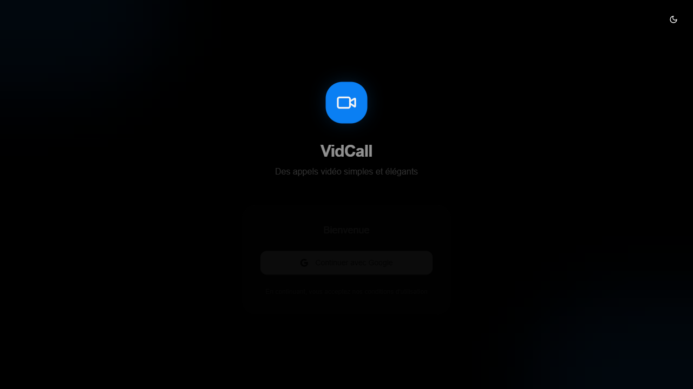

# Aura Connect




## Overview
Aura Connect is a modern communication platform built with React, TypeScript, Tailwind CSS, and Supabase. It provides video calling, messaging, contacts management, and real-time communication features with a focus on quality and user experience.

## Features
- **Video Calls**: High-quality video calling with WebRTC
- **Real-time Messaging**: Instant messaging with conversation history
- **Contacts Management**: Google Contacts synchronization
- **Call Quality Monitoring**: Real-time call quality indicators
- **Pre-call & Join Call**: Seamless call setup and joining flow
- **Theme Support**: Light and dark themes
- **Responsive Layout**: Desktop and mobile adaptive layouts
- **Supabase Backend**: Real-time database, auth, and edge functions

## Technology Stack
- **React 18** - UI library
- **TypeScript** - Type safety
- **Vite** - Build tool and dev server
- **Tailwind CSS** - Styling
- **shadcn/ui** - Component library
- **Supabase** - Backend, database, auth, and real-time
- **Vitest** - Testing framework
- **WebRTC** - Real-time communication

## Project Structure
```text
aura-connect/
├── src/
│   ├── components/
│   │   ├── auth/
│   │   ├── call/
│   │   ├── layout/
│   │   └── ui/
│   ├── hooks/
│   ├── integrations/
│   ├── pages/
│   ├── providers/
│   └── lib/
├── supabase/
└── public/
```

## Getting Started

### Prerequisites
- Node.js 18+
- npm or yarn

### Installation
```bash
git clone <repository-url>
cd aura-connect
npm install
```

### Development
```bash
npm run dev
```

Open `http://localhost:5173` to view the app.

### Build
```bash
npm run build
```

### Tests
```bash
npm run test
```

## Screenshots


## License
MIT